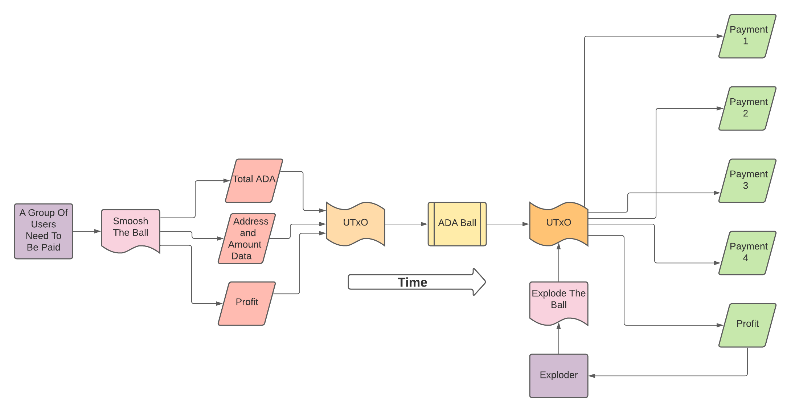

# One To Many

This attempts to solve the problem of handling group payments from another contract, allowing far more transactions to be validated on-chain without overloading a single contract.

A ball contains some amount of ADA that will be paid out to many addresses. If they wish, the group smooshing the ball can place an ADA prize for the wallet that explodes the ball. An exploding ball sends ADA out to their defined destinations and pays the exploder.

The goal is giving an incentive to the exploders to find a ball within the ecosystem. If the profit is greater than the fee then a exploder will gain ADA. Making the profit large enough to cover the fee becomes easy with full balls. A ball will max out at the protocol parameters which is about 16 addresses and amounts.

## Setting up

Build the project and compile the plutus script.
```
cd royalty-payout
cabal clean
cabal build -w ghc-8.10.4
cabal run royalty-payout
```

Run the local PAB with this command.
```
cabal exec -- plutus-starter-pab
```

In a new terminal we can now run some curl commands to interact with the local pab.

Check if the contract definitions are correct.
```
curl -s http://localhost:9080/api/contract/definitions | jq
```

Read more about the [PAB Scripts](pab_scripts/README.md) and check out the pab_scripts folder for bash scripts for interacting with the pab.

## Using

Trace test can be ran from the repl.

```
cabal repl royalty-payout.cabal
```

Try out these functions inside the repl.
```
smooshTheBall
smooshFail
explodeTheBall
```

Use the ```:reload``` call to rebuild inside the repl for quick testing.


## Flow

